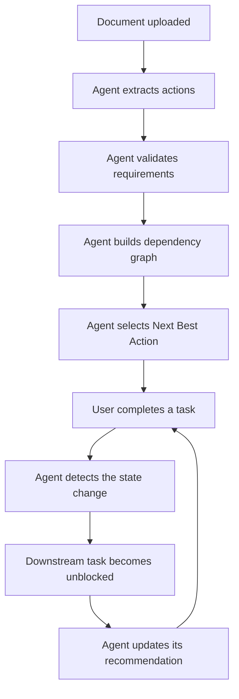
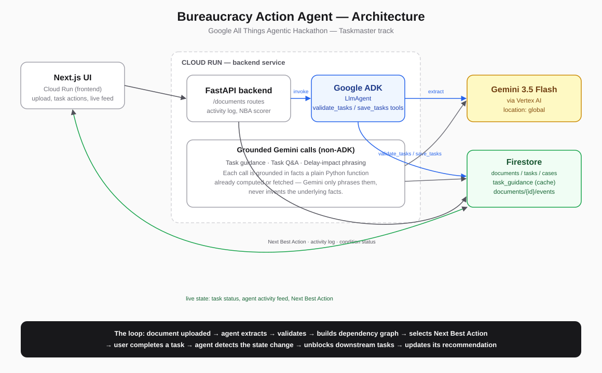
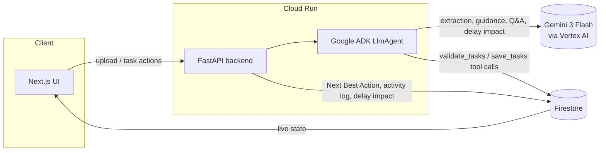

# Bureaucracy Action Agent

> An autonomous action agent that turns complex official documents into a
> persistent workflow — it tracks dependencies, reacts to your progress, and
> continuously decides what you should do next.

Google All Things Agentic Hackathon — Taskmaster track.

## Problem

Official documents (university letters, government notices, immigration
paperwork) tell people what an institution wants, but rarely make the next
steps obvious: what to do, in what order, by when, and what happens if you
delay.

## Solution

This is not a PDF summarizer. Upload a document once, and the agent:

1. Extracts required actions, deadlines, required documents, and
   dependencies between tasks, and persists the resulting workflow to
   Firestore.
2. Picks a **Next Best Action** — not a static list, a live recommendation
   that re-evaluates every time task state changes.
3. **Keeps reacting** after that first pass: when you complete a task, the
   agent detects which downstream tasks just became unblocked, recomputes
   the recommendation, and logs what it did to an activity feed — visibly,
   not silently.

That reactive loop is the actual "agent" part — everything else (guidance,
chat, delay-impact analysis) sits on top of it.

## Why This Is an Agent, Not a Wrapper

- **Real tool-calling**, not a single prompt-and-parse call: a
  `google.adk.agents.LlmAgent` reasons over the document and then calls its
  own `validate_tasks` and `save_tasks` tools — visible as actual ADK
  function-tool invocations in Cloud Run logs, not just JSON the backend
  happens to parse.
- **State, not a stateless transform**: task status, condition
  confirmations, and dependency state persist in Firestore, and every
  downstream computation (blocking, Next Best Action, delay impact) is
  re-derived from that live state, not from the original extraction.
- **Continuous re-evaluation**: completing a task doesn't just check a box —
  it triggers the agent to re-walk the dependency graph, pick a new Next
  Best Action, and narrate what changed (see the reactivity loop below).

## The Reactivity Loop



Every step in this loop is logged as a real event
(`backend/app/agent/activity_log.py`, Firestore
`documents/{id}/events`) and surfaced live in the UI's Agent Activity feed —
e.g. `Task completed: "Upload passport"` →
`Task unblocked: "Complete Form A"` →
`Recommendation changed to: "Complete Form A"`.

## Architecture





## How It Works

1. User uploads a document — PDF, Word, PowerPoint, plain text, or a photo
   of a document.
2. The backend extracts text (or, for images, passes the image straight to
   Gemini as multimodal input — no OCR library).
3. A real `google.adk.agents.LlmAgent` reasons over the document and
   extracts tasks, deadlines, dependencies, conditional requirements, and
   consequences as part of its own turn.
4. The agent calls its `validate_tasks` tool — an actual ADK function-tool
   call that dedupes tasks, normalizes dates, detects and breaks dependency
   cycles, and computes priority/risk deterministically (not left to the
   LLM) from deadline proximity and how many other tasks a given task
   blocks.
5. The agent calls its `save_tasks` tool (no arguments — it reads the
   already-validated tasks from the pipeline, so the model never has to
   re-transcribe them) to persist everything to Firestore with deterministic
   IDs, so a retry never double-writes.
6. The backend computes the initial **Next Best Action** and logs the whole
   sequence to the Agent Activity feed.
7. From here on, every task-status change re-walks the dependency graph,
   recomputes Next Best Action, and logs what changed — see
   [The Reactivity Loop](#the-reactivity-loop).

## Features

- **Next Best Action** — the single task to do right now, with a
  structured, localized list of *why* (priority, how many tasks it blocks,
  whether it's the highest-priority ready task, whether it has no
  prerequisites) — not one vague sentence.
- **Dependency graph / Critical Path view** — a full dependency diagram plus
  a toggle to the longest actual blocking chain, since the full graph gets
  unreadable past ~8 tasks.
- **Conditional task resolution** — tasks whose applicability depends on the
  user's situation (e.g. "only if your group has more than 4 members") get
  a real Yes/No confirmation; "doesn't apply" removes the task from
  blocking calculations and recommendations entirely.
- **Task guidance** ("How to complete this?") — clearly separates what the
  *document itself* states from the *agent's own suggested steps*, so trust
  and hallucination risk are never blurred together. Cached in Firestore so
  repeat requests don't re-call Gemini.
- **Ask about this task** — a task-scoped Q&A chat, grounded only in that
  task's own fields, its dependencies, and the document — it explicitly
  declines to answer from outside knowledge rather than guess.
- **Delay impact analysis** ("What if I delay this?") — the downstream
  impact is computed deterministically by walking the dependency graph in
  Python; Gemini only phrases the already-computed facts in natural
  language, never invents them.
- **Agent Activity Log** — a live, human-readable feed of what the agent
  actually did (extraction, validation, recommendation changes, unblocked
  tasks), backed by Firestore events, not just a static result screen.
- **Multi-format input** — PDF, Word, PowerPoint, plain text, and images
  (JPEG/PNG/WEBP, sent to Gemini multimodally).
- **Multilingual output** — pick an output language independent of the
  document's own language, changeable after the fact without re-uploading.

## Agent Tools

Defined in `backend/app/agent/adk_agent.py`, registered on the `LlmAgent`
via `google.adk.tools.FunctionTool`:

- `validate_tasks(tasks, warnings, missing_information, consequences)` —
  dedupes tasks, normalizes dates, detects and breaks dependency cycles
  (with a warning), and deterministically computes priority/risk from
  deadline proximity and blocking relationships.
- `save_tasks()` — persists the already-validated tasks to Firestore with
  deterministic per-document task IDs. Takes no LLM-supplied arguments by
  design: the validated task list is held in a small pipeline object the
  tools close over, so a retry can never duplicate a partial write.

Beyond the ADK agent's own tool loop, the backend does several more Gemini
calls outside the extraction turn — task guidance, task Q&A, and delay-impact
phrasing — each one grounded in facts computed or fetched by regular Python
code first, never left to the model to invent.

## Google Technologies Used

- Google ADK (`LlmAgent` + `FunctionTool`, see `backend/app/agent/adk_agent.py`) —
  real agent orchestration, not a bare Gemini call.
- Gemini 3 Flash (`gemini-3-flash-preview`) via Vertex AI — served from the
  `global` location, not the regional endpoint the rest of this project
  uses.
- Firestore (task/document/event storage)
- Cloud Run (deployment, both frontend and backend)

## API Overview

All routes are under `/documents` (`backend/app/routes/documents.py`):

| Method | Path                                | Purpose                                  |
| ------ | ------------------------------------ | ----------------------------------------- |
| POST   | `/upload`                            | Upload a document, run the agent pipeline |
| PATCH  | `/tasks/{task_id}`                   | Mark a task todo/done                     |
| PATCH  | `/tasks/{task_id}/condition-status`  | Confirm/deny a conditional task           |
| POST   | `/tasks/{task_id}/guidance`          | "How to complete this?" (cached)          |
| POST   | `/tasks/{task_id}/ask`               | Task-scoped Q&A                           |
| POST   | `/tasks/{task_id}/delay-impact`      | "What if I delay this?"                   |
| GET    | `/{document_id}/events`              | Agent activity log                        |

## Firestore Data Model

See `backend/app/models/schemas.py` for the task/document shape. Task IDs
are deterministic (`task_{document_id}_{index}`); events live in a
`documents/{document_id}/events` subcollection.

## Local Setup

### Backend

```bash
cd backend
python -m venv .venv
.venv/Scripts/activate   # Windows
pip install -r requirements.txt
gcloud auth application-default login   # Gemini/Firestore auth (ADC, no API key needed)
cp .env.example .env                    # fill in GOOGLE_CLOUD_PROJECT
uvicorn app.main:app --reload --port 8000
```

### Frontend

```bash
cd frontend
npm install
cp .env.local.example .env.local   # points at the backend, defaults to localhost:8000
npm run dev
```

## Cloud Deployment

Live demo:

- Frontend: https://bureaucracy-agent-web-760863161403.us-central1.run.app
- Backend: https://bureaucracy-agent-api-760863161403.us-central1.run.app

Both run on Cloud Run in project `bureaucracy-action-agent`, using a
dedicated service account (`bureaucracy-agent-run`) with `roles/datastore.user`
and `roles/aiplatform.user` — no API keys, auth is Application Default
Credentials end to end.

### Backend

```bash
cd backend
gcloud run deploy bureaucracy-agent-api \
  --source . \
  --region=us-central1 \
  --service-account=bureaucracy-agent-run@bureaucracy-action-agent.iam.gserviceaccount.com \
  --set-env-vars="GOOGLE_CLOUD_PROJECT=bureaucracy-action-agent,GOOGLE_CLOUD_LOCATION=global,FIRESTORE_DATABASE=(default),GEMINI_MODEL=gemini-3-flash-preview" \
  --allow-unauthenticated
```

### Frontend

`NEXT_PUBLIC_API_URL` is inlined into the JS bundle at build time, so the
image has to be built with the backend's URL baked in — a plain
`gcloud run deploy --source` can't pass a Docker build-arg, so build via
Cloud Build first, then deploy the built image:

```bash
cd frontend
gcloud builds submit --config=cloudbuild.yaml \
  --substitutions="_IMAGE=us-central1-docker.pkg.dev/bureaucracy-action-agent/cloud-run-source-deploy/bureaucracy-agent-web:latest,_API_URL=https://bureaucracy-agent-api-760863161403.us-central1.run.app"

gcloud run deploy bureaucracy-agent-web \
  --image=us-central1-docker.pkg.dev/bureaucracy-action-agent/cloud-run-source-deploy/bureaucracy-agent-web:latest \
  --region=us-central1 \
  --allow-unauthenticated
```

After the frontend's URL is known, update the backend's CORS allowlist:

```bash
gcloud run services update bureaucracy-agent-api \
  --region=us-central1 \
  --update-env-vars="ALLOWED_ORIGINS=https://bureaucracy-agent-web-760863161403.us-central1.run.app"
```

## Limitations

- No OCR for scanned image-only PDFs — image uploads work (sent to Gemini
  multimodally), but a PDF that's just a scanned image with no text layer
  will not extract text.
- Upload is synchronous, not a true background job: the request blocks
  until the full agent pipeline finishes (typically well under the demo's
  attention span, but not the "fire-and-poll" pattern a longer-running
  pipeline would need).
- Testing has focused on English, Turkish, and Norwegian documents; other
  languages should work but are less exercised.

## Safety

This tool helps users organize information found in official documents. It
does not provide legal advice, and users should verify critical
requirements with the issuing institution. The agent never invents
deadlines, required documents, or consequences — when information is
missing, it is marked as such, and every AI-generated suggestion (task
guidance, Q&A answers, delay-impact phrasing) is visibly separated from
what the source document actually states.

## Future Improvements

Google Calendar/Gmail integration, reminder notifications, true async
background processing with live progress streaming, OCR for scanned
documents, mobile app.
